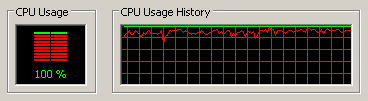

PatchQPF
========

A small utility to make Windows Update check for updates faster on certain types
of old hardware.

Warning!
--------

Scroll down to the part at the bottom where it talks about the warranty. Read
that part. Out loud. And consider yourself warned.

This has never been tested on:

* Windows Server, any version
* Windows 8
* Windows 8.1
* Windows 2000 or earlier
* Windows Me or earlier

See [`stats.csv`](stats.csv) for various test results.

Will this help me?
------------------

Look for the following symptoms:

* Task Manager, on the Processes tab, shows steady CPU usage with an instance of
  `svchost.exe`.
* Task Manager, on the Performance tab, and with "Show Kernel Times" enabled,
  shows the CPU time for `svchost.exe` being spent mostly as kernel time.

Before PatchQPF is applied, you should see something like:

Best results seem to occur on hardware released ~2010 or earlier.

So how do I download this?
--------------------------

(Or click [**(#)** releases](https://github.com/dmo2118/PatchQPF/releases) near
the top of the page.)

Miscellanea
-----------

Expect a warning from your antivirus software.

This code is so fresh that you should probably
[drop me a line](mailto:dmo2118@gmail.com) whether or not it works, and let me
know what version of Windows you have, and whether it's a 32 or 64-bit
installation. And if something goes wrong, I'd also like to know what's you've
got in the "System devices" category in Device Manager. (Protip: take a screen
shot in Windows with the Print Screen key, and paste the image with Ctrl-V into
Paint.)

Note that this only affects the time it takes to check for updates. This won't
make actually installing updates significantly faster.

PatchQPF is a Windows service. Starting the service applies the patch, but
stopping the service does not remove the patch. To disable PatchQPF, uninstall
it.

If you've timed the Windows Update check both without and with PatchQPF,
consider adding a line to [`stats.csv`](stats.csv) and issuing a pull request.

How it works
------------

Windows Update, while checking for updates, calls
[`QueryPerformanceFrequency`](https://msdn.microsoft.com/en-us/library/windows/desktop/ms644905%28v=vs.85%29.aspx)
constantly. `QueryPerformanceFrequency` in turn calls
[`NtQueryPerformanceCounter`](https://msdn.microsoft.com/en-us/library/bb432384%28v=vs.85%29.aspx), 
which retrieves both the time and the frequency. But reading this particular
system time source can be unusually slow depending on hardware and the version
of Windows in use -- see Microsoft's
[tale of woe](https://msdn.microsoft.com/en-us/library/windows/desktop/dn553408%28v=vs.85%29.aspx).
This in turn lengthens the already extraordinarily long Windows Update check by
approximately 2-4x, depending on hardware.

`PatchQPF.exe` hooks into the Windows Update process and replaces Microsoft's
`QueryPerformanceFrequency` with its own, faster implementation.

How can it be this bad? Doesn't Microsoft actually use their own software?
--------------------------------------------------------------------------

[I don't know.](https://www.drugabuse.gov/publications/research-reports/inhalants/how-can-inhalant-abuse-be-recognized)

Building from source
--------------------

For now, [MSYS2](https://msys2.github.io/) is required. Once you have that, from
a MinGW-w64 Win32 Shell, type `mingw32-make` from the source code root.

Acknowledgement
---------------

In fairness, I am not the first person to either
[find](http://www.askwoody.com/2016/checking-for-updates-still-takes-forever/comment-page-1/#comment-80228)
or
[fix](http://bertrand.deo.free.fr/TEMP/PatchWU.zip) this issue. I probably
should have done the necessary Google searches before I started on this;
nevertheless, the deed is done. For what it's worth though, with PatchQPF you
can just install it and forget about it; no further action is required.

Also, consider checking out <http://wu.krelay.de/en/>: this is a list of
updates that makes the Windows Update check take minutes instead of hours.

License
-------

PatchQPF is copyright (C) 2016 Dave Odell <<dmo2118@gmail.com>>

This program is free software: you can redistribute it and/or modify
it under the terms of the GNU General Public License as published by
the Free Software Foundation, version 3.

This program is distributed in the hope that it will be useful,
but WITHOUT ANY WARRANTY; without even the implied warranty of
MERCHANTABILITY or FITNESS FOR A PARTICULAR PURPOSE.  See the
GNU General Public License for more details.

You should have received a copy of the GNU General Public License
along with this program.  If not, see <https://www.gnu.org/licenses/>.
